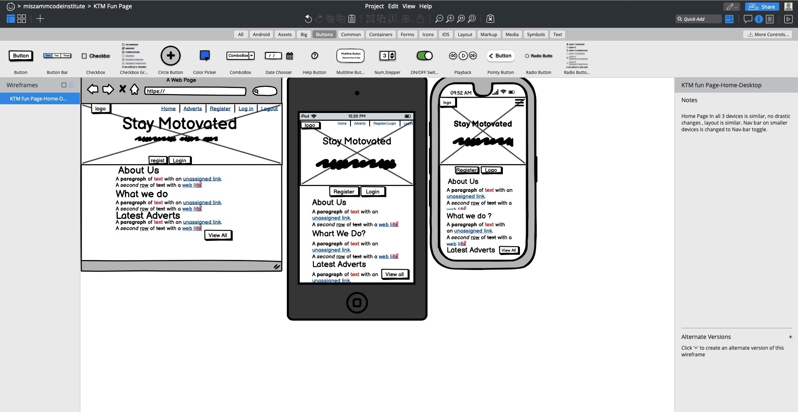
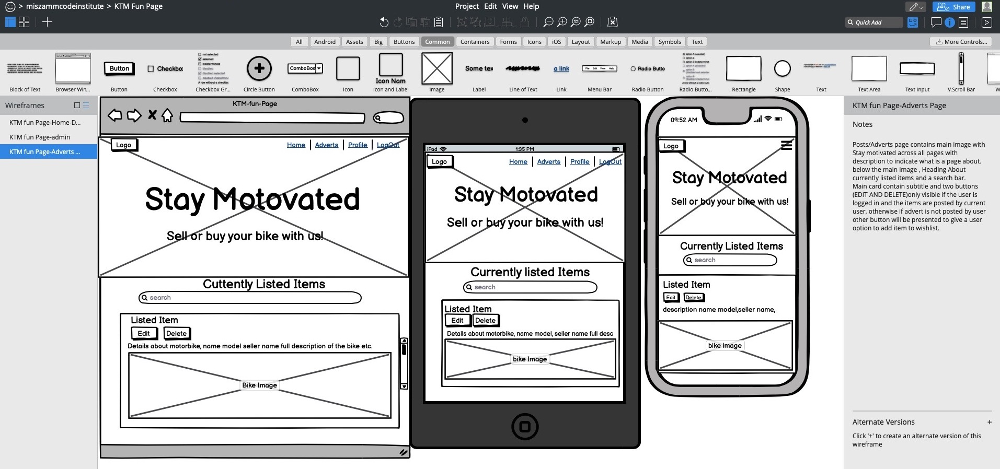
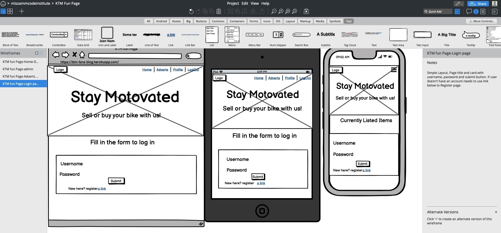

<h1>KTM Fun Page</h1>

Main Goal For This Project

The main goal for this project is app is to connect people who are kTM Brand enthusiasts, 
to help them to buy or sell their motorbikes. If oyu ever tried to advertise your car or bike 
true different platforms? It's not as straight forward as it might sound. IIf you go to Auto Tradr or Carzone or Done deal 
where you have all brands mixed up, the chances that your item will be seen often enough to convinced someone to buy it are rather low.
This App is brand specific and brings all people who are KTM BIkes fans. 
Massive thank you for visiting this ptoject!
If you have any feedback or questions, please find my contact deatails on GitHub and feel free to share your thoughts with me.

<h1>Table of content:</h1>

1. UX
- User Goals
- User Stories
- App Owner Goals
- Design (color scheeme, fonts, site structure)
2. Deployment 
- Local Deployment
- Deployment to Heroku
3. Wireframes and Database Structure
4. Features
- Existing Features
- Features For Further Implementation
5. Technologies
- Languages
- Frameworks and Libriares
6. Testing
7. Thanks To:

# 1. UX
<h2>User Goals:</h2>

- Home page gives a clear indication about it's purpose with most relevant data easly accesible

- The website has to be easy to navigate and self epxlenatory

- Has to work on all types of devices like tablet, mobile phone, desktop

- Has to give ability to update delete or obtain information

- has to give an option to easy control of logs 

- Sell or buy an item as easly and convinient as possible

<h2>User Stories</h2>

- As a user, I want website to be easy to navigate.

- As a user, I want website to be intuitive.

- As a user, I would like to  have an option to register 
  and have information related to my account accesible after log in.

- As a user, I would like to have an ability to add or remove items.

- As a user, I would like to be able to edit information relevant to my account.

- As a user, I would like to edit informations about items Advertised by me. 

- As a user, I would like to add to wishlist adverts I am interested in.

- As a user, I would like to have an option to delete items if they are no longer relevant.

- As a user, I want process to add, edit update and delete to be as easy as possible.

<h2>App Owner Goals</h2>

- To have an appealing website to connect pople with pasion to KTM Bikes, where users can buy and sell their bikes.

- Provide great website functionality for the users, by giving them easy acces to information they are looking for.

- To create website where users have their own space and they feel like they want to come back to.

<h2>Design (color scheeme, fonts, site structure)</h2>

Design Choices

For this project i used Bootstrap framework cold Clean Blog because it fits perfectly into a nature of the website and it will be 
very easy to update and expand in the future. On the other haand it's minimalistic design wil accomodate users in any age, and it will not be 
intimidating to people with lower computer skills. The target was to create self explanatory home page with nicley toned colors rather than 
wide selection of bright , overwhelming colors which might drow attention away from important things.
Colors used for this project are strictly assosiated with KTM brand.

Color Sccheeme

As mentioned above colors used for the site are colors asocciated with KTM brand, and consist orange , black, white and grey.
 
 - [Coolors](https://coolors.co/f2771a-1c1919-7e7e82-ffffff)

 - #Hex: #1C1919,	
Name: Eerie Black
RGB: (28, 25, 25)
CMYK: 0, 0.107, 0.107, 0.890
 - Hex: #F2771A,	
Name: Pumpkin
RGB: (242, 119, 26)
CMYK: 0, 0.508, 0.892, 0.050

 - HEX: #FFFFFF,
 RGB:(255,255,255)

 - HEX: #7E7E82,
 RGB: (	126, 126, 130)

 I have used a contrast checker in order to make sure that the contrast is sufficient. 
 This way my content will be easily readable.

Fonts

Appropreate fonds where included in bootstrap clean Blog framework, and font included are as follow:
Open Sans','Helvetica Neue',Helvetica,Arial,sans-serif.

Structure

I have choosen Bootstrap framework to create overall structure of this app. Bootstrap provides vast range of 
elements of CSS and Javascript which help to maintaine correct structure and functionality of the page. 

# 2. Deployment 

Website was created using GitHub, from there I used[Gitpod]()to write the code, followed by commits to git, and further pushed to my 
GitHub repository with use of "git push" command. I've deployed this project to Heroku and used "git push heroku master" to make sure  
all the changes to GitHub were also made to Heroku.

This project can be ran locally by following the following steps: ( I used Gitpod for development, so the following steps will be specific to Gitpod. 
The changes will have to be applied depending on your IDE. You can find more information about installing packages using pip and virtual environments [here](https://packaging.python.org/guides/installing-using-pip-and-virtual-environments/)

1. From  the aplication repository, click green code button to download zip file of repository.

2. Acces the folder in terminal window to instsll application [required modules](requirements.txt) with "pip3 install -r requirements.txt" .

3. Sign up/sign in to [Mongo.DB](https://www.mongodb.com/) to create new cluster

- Within the Sandbox, click the collections button and after click Create Database (Add My Own Data) called ktm_blog

- Set up the following collections: categories, posts and users Click [here]() to see the exact Database Structure

Under 
Key             | Value
----------------|-----------
_id             | ObjectId          
category_name   | String            

- Under security Menu , select Database Access.

- Add new Database user, keep in mind to secure credentials.

- Within  the Network Access option, add IP Address 0.0.0.0.0

4. In your IDE, create a file containing your environment variables called env.py at the root level of the application.
The file will contain the following variables:

import os

os.environ["IP"] = "0.0.0.0"

os.environ["PORT"] = "5000"

os.environ["SECRET_KEY"] = "YOUR_SECRET_KEY"

os.environ["DEBUG"] = "True"

os.environ["MONGO_URI"] = "YOUR_MONGODB_URI"

os.environ["MONGO_DBNAME"]= "DATABASE_NAME" 

For next step you need to prowide MONGO_URI, MONGO_DBNAME and also Secrete Key. First two variables are created or I should say provided by MongoDB, 
Secret Key would have to be updated with your own password. Persoanlly i used a [Random Keygen](https://randomkeygen.com)
I used Fort Knox Passwords - Secure enough for almost anything, like root or administrator passwords. 
To get Mongo_URI , go to clusters in MongoDB, click connect, than next step would be to choose option connect  your application and copy the link prowided.passwords and database names needs to be ubtated.
If you planing to push application to a public repository , make sure env.py is added to gitignore file.
5. To run application locally in the terminal, type

web: python3 app.py

To deploy project in Heroku , follow the steps below:
1. Lgin to Heroku, create a new app. Than choose the region you are in.
2. Create Procfile and requirements.txt in the terminal by using following commands:
Requirements.txt:

    pip3 freeze --local > requirements.txt

Procfile:

    echo web: python app.py > Procfile

3. Make sure your procfile contains following line:

    web: python app.py

4. In Heroku scroll the page down to deployment method section, select Github for automatic deploymnet.

5. From the inputs select your own github user enter name for your repo, than click search to find your repo, than sellect "connect" button.

6. From the settings select "Reveal config vars", and apply variables storred in env.py file(MONGO_DBNAME, MONGO_URI, SECRET_KEY, PORT, IP).
To prevent DEBUG being in active state in live website, DEBUG variable shouldn't be set up in config vars. 

7. When variables are set correctly click "Deploy" followed by "Enable automatic deployment".
Deploy branch, when Heroku finish building the app select "view app" to see app running.

8. Commit and push changes.
# 3. Wireframe

The wireframe was designed using [Balsamiq](https://balsamiq.com/) and links to the final version can be found below:

- 
- 
- 
- 

# 4. 

# 

# 9. Technologies
Languages
- [HTML](https://html.com/)
- [CSS](https://developer.mozilla.org/en-US/docs/Web/CSS)
- [JavaScript](https://www.javascript.com/)
- [Python](https://www.python.org/)

Frameworks, Libraires
- [Bootstrap](https://getbootstrap.com/)
- [Font Awesome](https://www.google.com/search?q=font+awesome&oq=&sourceid=chrome&ie=UTF-8)
- [Google Fonts](https://www.google.com/search?q=google+fonts&oq=google+fonts&aqs=chrome..69i57j35i39j0l6.5569j0j7&sourceid=chrome&ie=UTF-8)
- [jQuery](https://jquery.com)

Tools 

- [GitPod](https://www.gitpod.io/)
- [Flask](https://flask.palletsprojects.com/en/1.1.x/)
- [PyMongo](https://www.mongodb.com/)
- [Heroku](https://dashboard.heroku.com/apps)
- [Jinja](https://jinja.palletsprojects.com/en/2.11.x/)
- [MongoDB Atlas](https://www.mongodb.com/cloud/atlas)
- [Balsamic](https://balsamiq.com/)
- [W3C CSS](https://www.google.com/search?client=safari&rls=en&q=w3schools&ie=UTF-8&oe=UTF-8)
- [W3C HTML](https://www.google.com/search?client=safari&rls=en&q=w3schools&ie=UTF-8&oe=UTF-8)

# 7. Thanks to:
- Gitpod Since I am typing this text through Gitpod. All code was created through Gitpod and the workspace for this project resides there.
- GitHub which is used to host and deploy the project
- Font awesome community for developing this great resource
- Bootstrap crew for developing and maintaining such great library although in the end i didn't use it
- jQuery developers for all the work and great documentation
- 
- Microsoft for developing VScode and providing it free of charge 
- Traversy Media, Academind, Pretty Printed, Code and Create, Benjamin Siegel and Dark Code for sharing their proffesional knowledge
- Code Institute team: the other students on Slack
- Last but not least my very best mentor Felipe Souza Alarcon for his constant support, proffesional advice and motivation 
even ehen things are not going ahead according to plan. 
